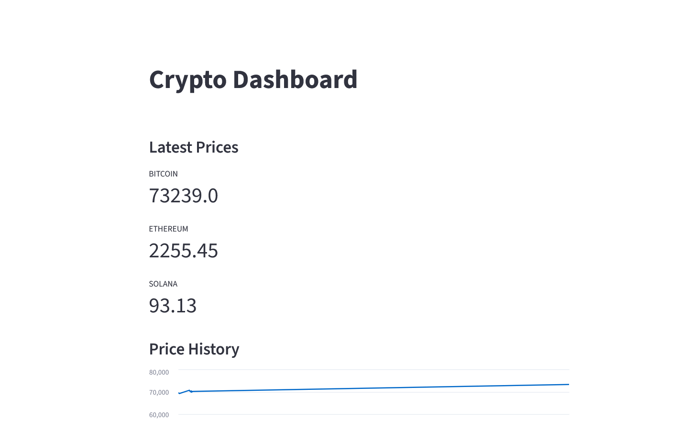

# Crypto Data Pipeline

This project collects cryptocurrency prices from the CoinGecko API and stores them in PostgreSQL.  
A Streamlit dashboard visualizes the collected data in real time.

## Architecture

CoinGecko API
↓
Python Data Pipeline
↓
PostgreSQL Database
↓
Streamlit Dashboard

## Technologies

- Python
- PostgreSQL
- Streamlit
- CoinGecko API

## Run pipeline

python run_pipeline_loop.py

## Run dashboard

streamlit run dashboard.py

## Dashboard

